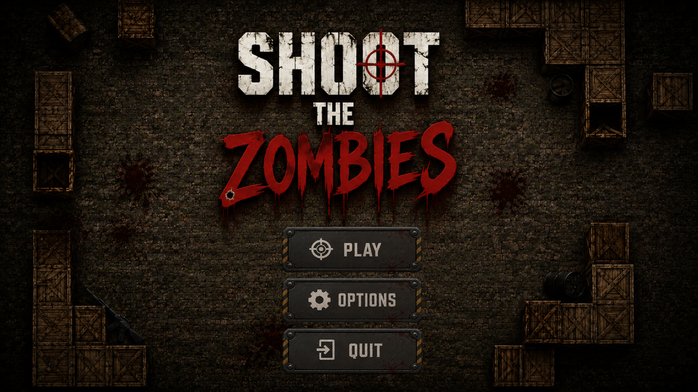
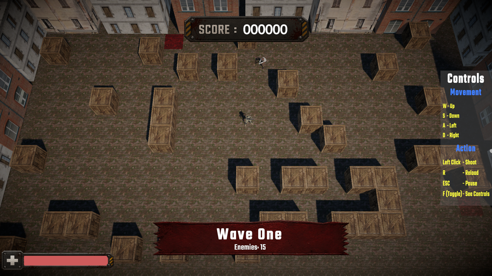
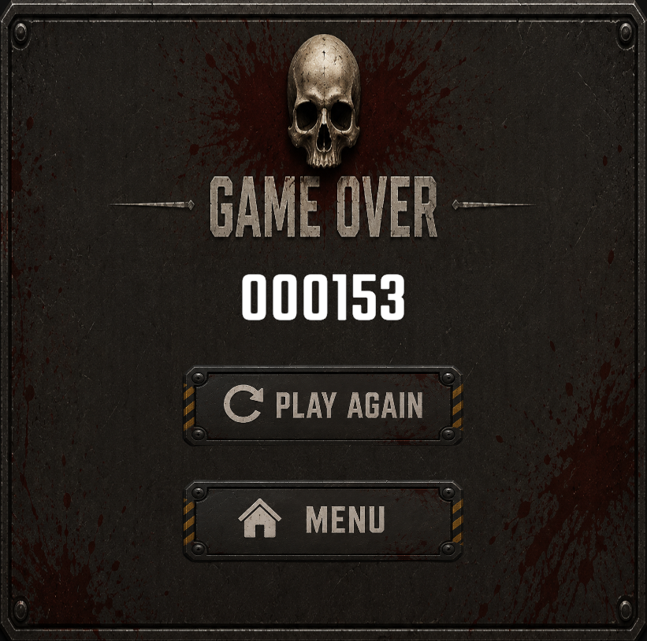

# 🧟 Shoot The Zombies

<p align="center">


</p>

<p align="center">
A <b>3D wave-based zombie survival shooter</b> developed in Unity as part of my game development learning journey.
</p>

> **📖 Learning Project**  
> This project was created by following **Sebastian Lague's** excellent **Top Down Shooter** Unity tutorial series. During the learning process, I customized the project by redesigning the user interface, creating menus, adding UI animations, and polishing the overall presentation to strengthen my understanding of Unity game development.

---

# 📖 Overview

**Shoot The Zombies** is a 3D wave-based zombie survival shooter built in **Unity** to learn the fundamentals of gameplay programming and game architecture.

The project introduced me to player movement, shooting mechanics, enemy AI, procedural map generation, wave management, and modular game systems. To further practice Unity development, I redesigned the UI, implemented custom menus, and added animations to improve the overall player experience.

---

# 📸 Screenshots

<p align="center">
    
</p>

<p align="center">
    
</p>

<p align="center">
    
</p>

---

# ✨ Features

- 🧟 Wave-Based Zombie Survival
- 🗺️ Procedural Map Generation
- 🤖 NavMesh Powered Enemy AI
- 🔫 Shooting & Reload Mechanics
- 💥 Projectile-Based Weapon System
- 📈 Score Tracking
- 🎵 Audio Management
- 🛠️ Custom Map Editor
- 🎨 Custom UI & Menu Design
- ✨ UI Animations

---

# 🎯 Gameplay Systems

### 🎮 Player

- Character movement
- Weapon handling
- Shooting system
- Reload mechanics
- Health system

### 🤖 Enemy AI

- NavMesh pathfinding
- Player chasing
- Enemy attacks
- Wave spawning

### 🗺️ Procedural Generation

- Random map generation
- Dynamic obstacle placement
- Custom map editor

### 🖥️ User Interface

- Main Menu
- Options Menu
- In-game HUD
- Score Display
- Wave Counter
- Pause Menu
- Game Over Screen
- Animated UI Elements

---

# 🛠️ Technologies Used

| Category | Technologies |
|----------|--------------|
| **Engine** | Unity 6 |
| **Language** | C# |
| **AI** | Unity NavMesh |
| **UI** | Unity UI, TextMeshPro |
| **Tools** | Visual Studio, Git |

---

# 🎮 Controls

| Action | Key |
|--------|-----|
| Move | **W A S D** |
| Aim | **Mouse** |
| Shoot | **Left Mouse Button** |
| Reload | **R** |
| Toggle Controls | **F** |
| Pause | **Esc** |

---

# 📚 What I Learned

- Unity Gameplay Programming Fundamentals
- Player & Enemy System Architecture
- AI Navigation using Unity NavMesh
- Procedural Map Generation
- Wave Management Systems
- UI Design & Animation
- Organizing Unity Projects
- Writing Clean C# Scripts

---

# 🚀 Future Improvements

- Multiple weapon types
- Boss enemies
- Difficulty scaling
- Power-up system
- Save & Load functionality
- Enhanced visual effects

---

# 📂 Project Structure

```text
Assets
│
├── Scripts
├── Prefabs
├── Materials
├── Animations
├── Audio
└── Scenes
```

---

# 🙏 Acknowledgements

This project follows the excellent **Top Down Shooter** Unity tutorial series created by **Sebastian Lague**.

The tutorial provided the foundation for learning gameplay programming concepts in Unity. I further customized the project by redesigning the user interface, creating menus, adding UI animations, and polishing the overall presentation as part of my learning journey.

Special thanks to **Sebastian Lague** for creating high-quality educational content for the Unity community.

---

# 👨‍💻 My Contribution

Although the core gameplay follows the tutorial series, I customized the project by:

- Designing and implementing a new user interface
- Creating the Main Menu, Pause Menu, Options Menu, and Game Over screens
- Adding UI animations and presentation polish
- Integrating and organizing project assets
- Testing and refining the overall gameplay experience

---

<p align="center">
⭐ If you found this project interesting, consider giving it a star!
</p>
